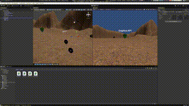

## Overview

## Core Components

### PlayerController.cs
Handles player movement with support for both traditional input and gaze-based movement. Attached to the Main Camera.

**Public Properties:**
- `moveSpeed`: Movement speed (default: 2f)
- `enableGazeMovement`: Toggle gaze-based movement
- `requireButtonForGaze`: Require screen touch/click for gaze movement

### CameraPointer.cs
Implements raycasting from the camera to detect objects the player is looking at. Fires events when the raycast enters or exits objects.

**Public Properties:**
- `range`: Raycast distance (default: 5f)

**Events:**
- `OnRaycastEnter`: Triggered when raycast hits a new object
- `OnRaycastExit`: Triggered when raycast stops hitting an object

### Collectable.cs
Defines collectible objects that respond to the player's gaze and the shield's state.

**Public Properties:**
- `cameraPointer`: Reference to CameraPointer component
- `shieldNotifier`: Reference to ShieldNotifier component
- `moveSpeed`: Speed at which collected objects move (default: 2f)

**Behavior:**
- Changes to red when player looks at it
- Moves towards camera when collected
- Can be retrieved by looking at the shield

### ShieldNotifier.cs
Special object that allows recovering collected items when gazed upon.

**Public Properties:**
- `cameraPointer`: Reference to CameraPointer component

**Events:**
- `OnShieldPointerEnter`: Fired when player starts looking at shield
- `OnShieldPointerStay`: Fired continuously while player looks at shield

**Behavior:**
- Turns blue when player gazes at it
- Returns to original color when gaze exits
- Triggers collectible retrieval

## Setup Instructions

### Scene Requirements
1. Terrain or ground plane
2. Main Camera with Cardboard XR components
3. Collectible objects placed in the scene
4. Shield recovery object

### Component Assignment
1. **Main Camera:**
   - Add `PlayerController.cs`
   - Add `CameraPointer.cs`

2. **Collectible Objects:**
   - Add `Collectable.cs` to each collectible
   - Assign `cameraPointer` reference
   - Assign `shieldNotifier` reference
   - Add Collider component (required for raycasting)

3. **Shield Object:**
   - Add `ShieldNotifier.cs`
   - Assign `cameraPointer` reference
   - Add Collider component (required for raycasting)

### Build Settings
- **Platform:** Android
- **XR Plugin:** Google Cardboard XR Plugin
- Ensure Android build settings are configured (minimum API level, etc.)
